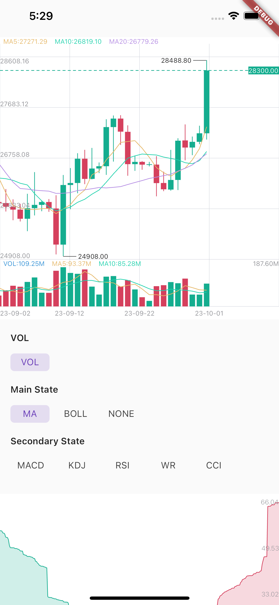
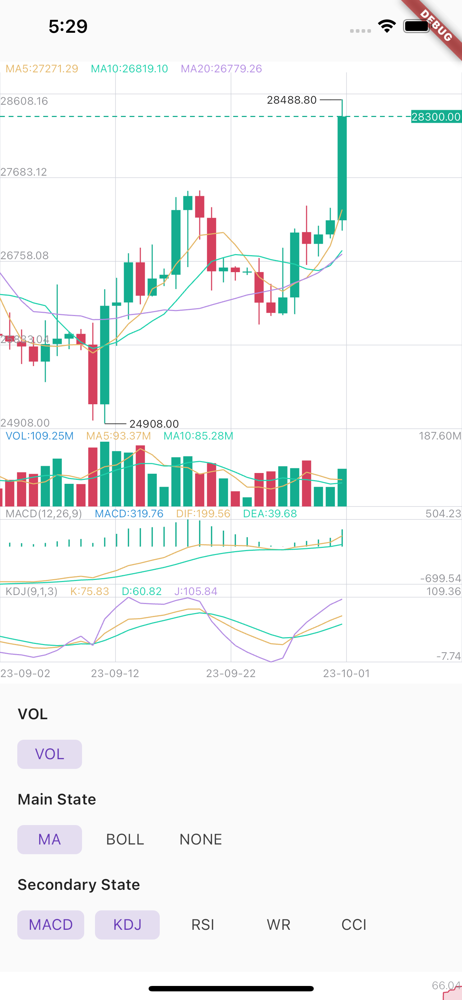

# K Chart Plus Package

## Feature

Maybe this is the best k chart in Flutter.Support drag,scale,long press,fling.And easy to use.

|Example1|Example2|
|:-------------------------:|:-------------------------:|
|  |  |

## Installation

First, add `k_chart_plus` as a [dependency in your pubspec.yaml file](https://flutter.dev/using-packages/).

```yaml
k_chart_plus: ^1.0.2
```

> If you don't want to support selecting multiple secondary states, you need to use: 
> ```
> k_chart_plus:
>    git:
>      url: https://github.com/TrangLeQuynh/k_chart_plus
>      ref: single #branch name
> ```
>


## Usage

**When you change the data, you must call this:**
```dart
DataUtil.calculate(datas); //This function has some optional parameters: n is BOLL N-day closing price. k is BOLL param.
```

### Use K line chart

```dart
KChartWidget(
    chartStyle, // Required for styling purposes
    chartColors,// Required for styling purposes
    datas,// Required，Data must be an ordered list，(history=>now)
    mBaseHeight: 360, //height of chart (not contain Vol and Secondary) 
    isLine: isLine,// Decide whether it is k-line or time-sharing
    mainState: _mainState,// Decide what the main view shows
    secondaryStateLi: _secondaryStateLi,// Decide what the sub view shows
    fixedLength: 2,// Displayed decimal precision
    timeFormat: TimeFormat.YEAR_MONTH_DAY,
    onLoadMore: (bool a) {},// Called when the data scrolls to the end. When a is true, it means the user is pulled to the end of the right side of the data. When a
    // is false, it means the user is pulled to the end of the left side of the data.
    maDayList: [5,10,20],// Display of MA,This parameter must be equal to DataUtil.calculate‘s maDayList
    volHidden: false,// hide volume
    showNowPrice: true,// show now price
    isOnDrag: (isDrag){},// true is on Drag.Don't load data while Draging.
    isTrendLine: false, // You can use Trendline by long-pressing and moving your finger after setting true to isTrendLine property. 
    xFrontPadding: 100 // padding in front
),
```
### Use Depth chart

```dart
DepthChart(_bids, _asks, chartColors) //Note: Datas must be an ordered list，
```

### Dark | Light Theme

`ChartColor` helped to set the color for the chart. You need to flexibly change according to your theme configuration to ensure UI.

>
> If you need to apply multi theme, you need to change at least the colors related to the text, border, grid and background color
>

```dart
late ThemeData themeData = Theme.of(context);
late ChartColors chartColors = ChartColors(
  bgColor: themeData.colorScheme.background,
  defaultTextColor: themeData.textTheme.labelMedium?.color ?? Colors.grey,
  gridColor: themeData.dividerColor,
  hCrossColor: themeData.textTheme.bodyMedium?.color ?? Colors.white,
  vCrossColor: themeData.disabledColor.withOpacity(.1),
  crossTextColor: themeData.textTheme.bodyMedium?.color ?? Colors.white,
  selectBorderColor: themeData.textTheme.bodyMedium?.color ?? Colors.black54,
  selectFillColor: themeData.colorScheme.background,
  infoWindowTitleColor: themeData.textTheme.labelMedium?.color ?? Colors.grey,
  infoWindowNormalColor: themeData.textTheme.bodyMedium?.color ?? Colors.white,
);
```


Apply in k line chart:

```dart

KChartWidget(
    data,
    ChartStyle(),
    ChartColors().init(), ///custom chart color
    chartTranslations: ChartTranslations(
        date: 'Date'
        open: 'Open',
        high: 'High',
        low: 'Low',
        close: 'Close'
        changeAmount: 'Change',
        change: 'Change%',
        amount: 'Amount',
        vol: 'Volume',
    ),
    mBaseHeight: 360,
    isTrendLine: false,
    mainState: mainState,
    secondaryStateLi: secondaryStates,
    fixedLength: 2,
    timeFormat: TimeFormat.YEAR_MONTH_DAY,
);
```

### Thanks

[gwhcn/flutter_k_chart](https://github.com/gwhcn/flutter_k_chart)

[OpenFlutter/k_chart](https://github.com/OpenFlutter/k_chart)
